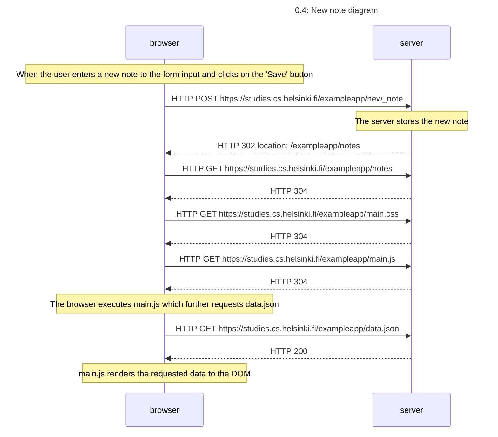

```mermaid
sequenceDiagram
title 0.4: New note diagram

participant browser
participant server

note over browser: When the user enters a new note to the form input and clicks on the 'Save' button

browser->>server: HTTP POST https://studies.cs.helsinki.fi/exampleapp/new_note

note over server: The server stores the new note

server-->>browser: HTTP 302 location: /exampleapp/notes

browser->>server: HTTP GET https://studies.cs.helsinki.fi/exampleapp/notes
server-->>browser: HTTP 304

browser->>server: HTTP GET https://studies.cs.helsinki.fi/exampleapp/main.css
server-->>browser: HTTP 304
browser->>server: HTTP GET https://studies.cs.helsinki.fi/exampleapp/main.js
server-->>browser: HTTP 304

note over browser: The browser executes main.js which further requests data.json

browser->>server: HTTP GET https://studies.cs.helsinki.fi/exampleapp/data.json
server-->>browser: HTTP 200

note over browser: main.js renders the requested data to the DOM
```