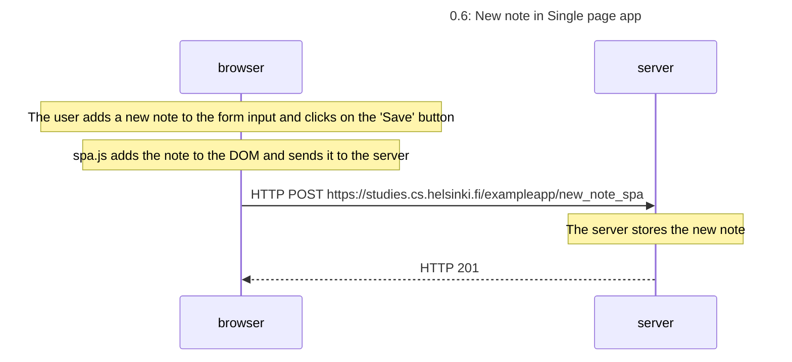

```mermaid

sequenceDiagram
title 0.6: New note in Single page app

participant browser
participant server

note over browser: The user adds a new note to the form input and clicks on the 'Save' button

note over browser: spa.js adds the note to the DOM and sends it to the server

browser->>server: HTTP POST https://studies.cs.helsinki.fi/exampleapp/new_note_spa

note over server: The server stores the new note

server-->>browser: HTTP 201
```